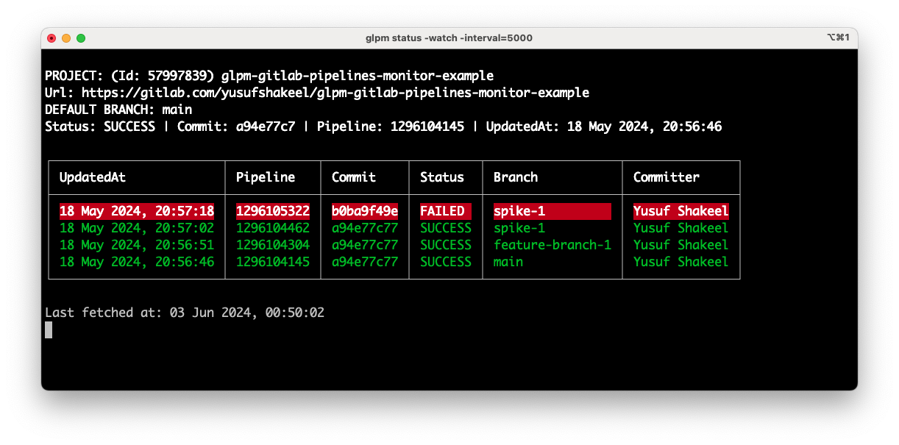

# glpm (gitlab-pipelines-monitor)

This project will monitor the pipelines of your GitLab projects.

[](https://github.com/yusufshakeel/glpm)
[](https://www.npmjs.com/package/glpm)
[](https://www.npmjs.com/package/glpm)



## Table of Contents

- [glpm (gitlab-pipelines-monitor)](#glpm-gitlab-pipelines-monitor)
  - [Table of Contents](#table-of-contents)
  - [Prerequisite](#prerequisite)
  - [Getting started](#getting-started)
  - [Run](#run)
  - [Initialise](#initialise)
  - [Check status](#check-status)
  - [Help](#help)
  - [License](#license)
  - [Donate](#donate)

## Prerequisite

- Node (v14 or higher)

## Getting started

Install the package globally.

```shell
npm i -g glpm
```

## Run

```shell
glpm
```

## Initialise

```shell
glpm init
```

## Check status

```shell
glpm status
```

Run in watch mode.

```shell
glpm status -watch -interval=10000
```

## Help

```shell
glpm --help
```

## License

It's free :smiley:

[MIT License](https://github.com/yusufshakeel/glpm/blob/main/LICENSE) Copyright (c) 2024 Yusuf Shakeel

## Donate

Feeling generous :smiley: [Donate via PayPal](https://www.paypal.me/yusufshakeel)
